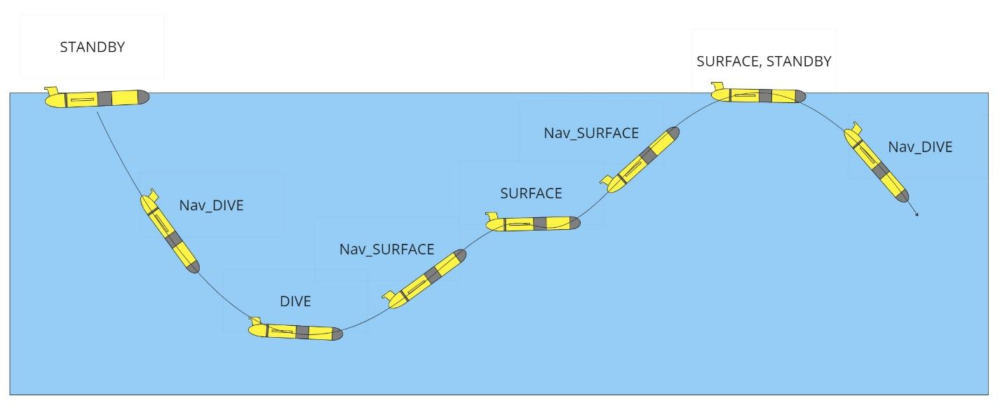
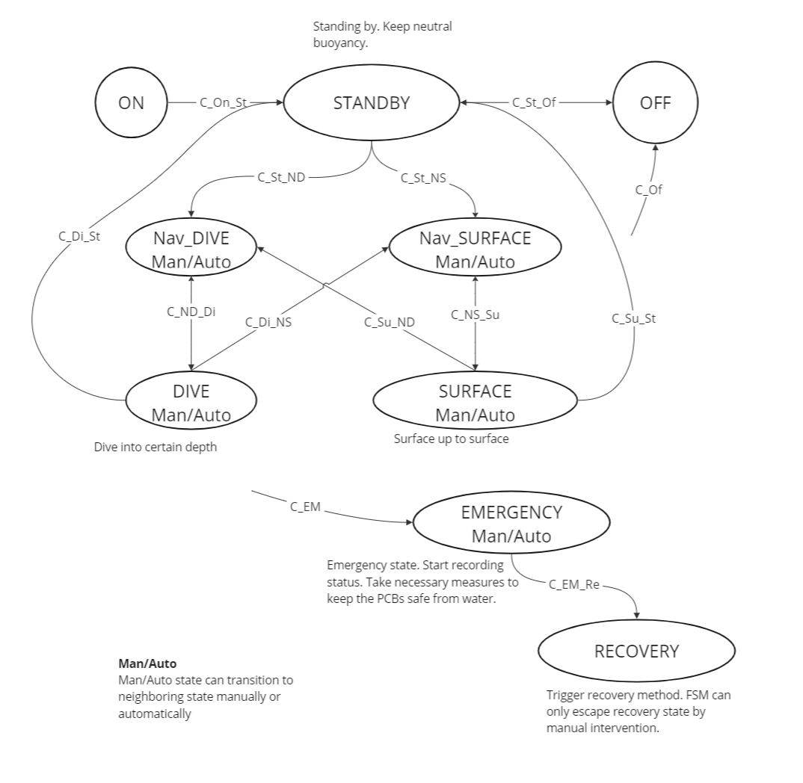

# `HLCS_FSM`

- **Package:** `<package_name>`
- **Executable:** `<executable_name>`
- **Status:** `Working / In progress / Experimental / Broken`
- **People:** `<name(s)>`


## How to run it

The simplest way to get this node running:

**prereqs**
* `<dependency / hardware / another node>`
* `<configuration steps>`

**Command**

```bash
<command>
```
most nodes can be run using `ros2 run <package_name> <executable_name>`


## How it works


### FSM Development Phases


FSM phase X is defined as a FSM that supports all control systems from 1 up to phase X (see Control System Implementation Phases section)

### FSM States

| State | Responsibility and functionality |
| :---- | :---- |
| ON | System bootup and calibration. |
| STANDY | Takes input x waiting time. Wait for time x. Report status back to a ground station. |
| OFF | Save data and turn everything off sequentially. |
| DIVE_DECENT | Actuate ‘buoyancy engine’, ‘moving mass’ and ‘rolling mass’ to navigate a glider to a given waypoint. |
| DIVE_ACCENT | Actuate ‘buoyancy engine’, ’moving mass’ and ‘rolling mass’ to navigate a glider to a given waypoint. |
| SURFACE | Glider just finished a surface navigation mechanism and has arrived at a given waypoint. Takes input x waiting time. Wait for time x. Report status back to a ground station. Take a transition to the next state. |
| EMERGENCY/RECOVERY | Check what was the issue. Save everything. Take a transition to RECOVERY as soon as possible. Trigger recovery methods such as maximize buoyancy engine, move moving mass and rolling mass to surface, constantly report back to a ground station and trigger any mechanical recovery method.|




### FSM State Transitions

| Condition name | From state | To state | Condition description |
| :---- | :---- | :---- | :---- |
| C\_On\_St | ON | STANDBY | System boot-up and calibration are finished and machine ready for deployment. |
| C\_St\_Of | STANDBY | OFF | Power off command received from PEN board. |
| C\_St\_ND | STANDBY | Nav\_DIVE | For the first iteration, a command must be given to take a transition. Either through Bluetooth or CLI command to Pi. After the first iteration, C\_St\_ND is taken when standby time expires and there is a next way point to navigate. |
| C\_St\_NS | STANDBY | Nav\_SURFACE | For the first iteration, a command must be given to take a transition. Either through Bluetooth or CLI command to Pi. After the first iteration, C\_St\_ND is taken when standby time expires and there is a next way point to navigate. |
| C\_ND\_Di | Nav\_DIVE | DIVE | When a glider has arrived at the destination waypoint, It takes a transition from Nav\_DIVE to DIVE. When DIVE's standby time expires, it takes a transition from DIVE to Nav\_DIVE if the next waypoint is deeper than the current waypoint where a glider is stationing. |
| C\_NS\_Su | Nav\_SURFACE | SURFACE | When a glider has arrived at the destination waypoint, it takes a transition from Nav\_SURFACE to SURFACE. When SURFACE's standby time expires, it takes a transition from SURFACE to Nav\_SURFACE if the next waypoint is shallower than the current waypoint where a glider is stationing. |
| C\_Di\_NS | DIVE | Nav\_SURFACE | When DIVE's standby time expires, it takes a transition from DIVE to Nav\_SURFACE if the next waypoint is shallower than the current waypoint where a glider is stationing. |
| C\_Su\_ND | SURFACE | Nav\_DIVE | When SURFACE's standby time expires, it takes a transition from SURFACE to Nav\_DIVE if the next waypoint is deeper than the current waypoint where a glider is stationing. |
| C\_Di\_St | DIVE | STANDBY | When the glider has arrived at the final destination, it takes a transition to STANDBY. |
| C\_Su\_St | SURFACE | STANDBY | When the glider has arrived at the final destination, it takes a transition to STANDBY. |
| C\_EM | Any state | EMERGENCY | If a leak has been detected, out of battery, system malfunction is detected or the glider is failing to arrive at its destined waypoint for too long, the watchdog computer did not receive and tickle from the main computer it transitions to EMERGENCY state. |
| C\_EM\_Re | EMERGENCY | RECOVERY | Necessary means have been taken (explained in **Appendix A**), take a transition to RECOVERY as soon as possible. |
| C\_Of | Any state | OFF | If the Off command has been received from Bluetooth, CLI or mechanical magnetic button, take a transition to OFF state. |




### Control System Implementation Phases

To allow for testing at many points during the development of the control system, development of each part of the system will be broken up into various phases. In a mission planning or other configuration file, the phase of each control system component to use can be selected. This allows for different parts of the system to be in different phases of development at a given time and allows for easy fallback to a earlier phase if issues with a newly added phase are encountered.

The control system will be broken down into the following components:
* Depth Control
* Pitch Control
* Roll Control


### Depth Control

* **Phase 1** - Timed Dive
    * Fixed ballast tank fill setting
    * Fixed decent and accent time

* **Phase 2** - Target Depth Dive
    * Fixed decent and accent ballast tank fill setting.
    * Dive until target depth reached

* **Phase 3 (V0 Target)** - Target Depth/Rate Dive
    * Fixed decent and accent decent rate settings
    * Dive until target depth reached

* **Phase 4 (V0 Stretch Target)** - Waypoint Dive
    * Fixed decent and accent decent rate settings calculated based on distance to waypoint
    * Dive until target depth reached

* **Phase 5** - Fixed Current Correction Waypoint Dive
    * Fixed decent and accent decent rate settings calculated based on distance to waypoint with a fixed ocean current correction applied.
    * Dive until target depth reached

* **Phase 6** - Dynamic Current Correction Waypoint Dive
    * Dynamic decent and accent decent rate settings calculated based on distance to waypoint and dead reckoning data.
    * Dive until target depth reached


### Pitch Control

* **Phase 1** - Fixed Moving Mass
    * Fixed decent and accent moving mass position settings

* **Phase 3 (V0 Target)** - Fixed Pitch
    * Fixed decent and accent pitch settings

* **Phase 4 (V0 Stretch Target)** - Waypoint Pitch
    * Fixed decent and accent pitch settings calculated based on distance to waypoint

* **Phase 5** - Fixed Current Correction Waypoint Pitch
    * Fixed decent and accent pitch settings calculated based on distance to waypoint with a fixed ocean current correction applied.

* **Phase 6** - Dynamic Current Correction Waypoint Pitch
    * Dynamic decent and accent pitch settings calculated based on distance to waypoint and dead reckoning data.


### Roll Control

* **Phase 1** - Fixed Roll Motor
    * Fixed decent and accent roll motor rotation settings.

* **Phase 2** - Fixed Roll
    * Fixed glider roll angle setting

* **Phase 3 (V0 Target)** - Fixed Compass Heading
    * Fixed compass heading setting

* **Phase 4 (V0 Stretch Target)** - Waypoint Compass Heading
    * Fixed compass heading calculated based on waypoint

* **Phase 5** - Fixed Current Correction Waypoint Compass Heading
    * Fixed compass heading calculated based on waypoint with a fixed ocean current correction applied.

* **Phase 6** - Dynamic Current Correction Waypoint Compass Heading
    * Dynamic compass heading setting calculated based on waypoint and dead reckoning data.


## Important parts

* Part (file / class / function) : what it does (short explanation)
* Part (file / class / function) : what it does (short explanation)
 


## What has been done

A lightweight record of meaningful progress. Only needed if node is `in progress` otherwise delete 

* thing that works 
* other thing that works

Focus on information that would help another team member understand the state of the node.


## To do

* `<next task>`
* `<bug to investigate>`
* `<cleanup / improvement>`
* `<idea that isn't currently important>`


## Known issues / gotchas

Things that might confuse the next person:

* `<weird behavior>`
* `<hardware limitation>`
* `<temporary workaround>`
* `<assumption the code currently makes>`

If something took you an hour to figure out, put it here so the next person doesn't have to.


## Testing

How have we tested this?

* [ ] Runs locally
* [ ] Runs on PI
* [ ] Integration tested
* [ ] Tested in water
* [ ] Tested on the glider


## Useful references

Anything that helped while working on this node:

* `<datasheet>`
* `<Paper>`
* `<documentation>`
* `<related node>`
* `<issue / design document>`


## Scratchpad / random stuff

This section is intentionally unstructured.


* `<random useful thing>`
* `<questions>`
* `<idea to try later>`
